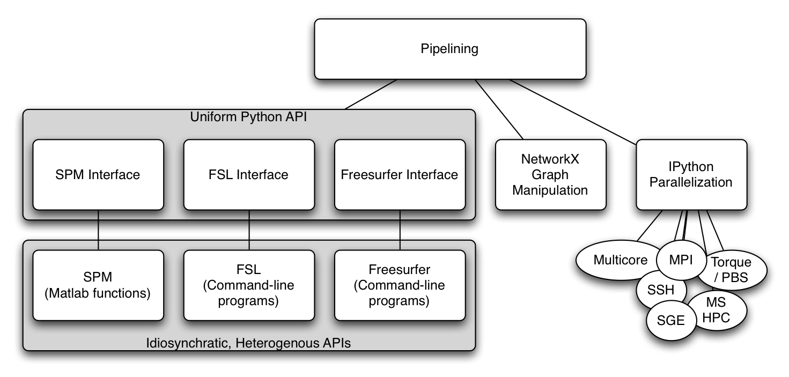
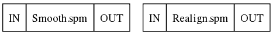
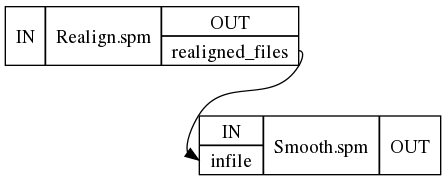
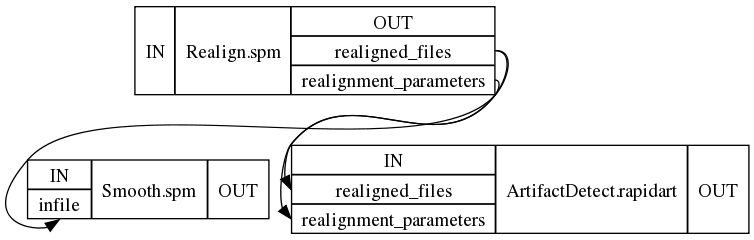

.. _tutorial_101:

============
Pipeline 101
============

A workflow or pipeline is built by connecting processes or nodes to each
other. In the context of nipype, every interface can be treated as a pipeline
node having defined inputs and outputs. Creating a workflow then is a matter
of connecting appropriate outputs to inputs. Currently, workflows are limited
to being directional and cannot have any loops, thereby creating an ordering to
data flow. The following nipype component architecture might help understanding
some of the tutorials presented here.

My first pipeline
=================

Although the most trivial workflow consists of a single node, we will
create a workflow with two nodes: a realign node that will send
the realigned functional data to a smoothing node. It is important to note that
setting up a workflow is separate from executing it.

**1. Import appropriate modules**

.. testcode::

   import nipype.interfaces.spm as spm         # the spm interfaces
   import nipype.pipeline.engine as pe         # the workflow and node wrappers

**2. Define nodes**

Here we take instances of interfaces and make them pipeline compatible by
wrapping them with pipeline specific elements. To determine the inputs and outputs
of a given interface, please see :ref:`interface_tutorial`. Let's
start with defining a realign node using the interface
:class:`nipype.interfaces.spm.Realign`

.. testcode::

   realigner = pe.Node(interface=spm.Realign(), name='realign')
   realigner.inputs.in_files = 'somefuncrun.nii'
   realigner.inputs.register_to_mean = True

This would be equivalent to:

.. testcode::

   realigner = pe.Node(interface=spm.Realign(infile='somefuncrun.nii',
                                             register_to_mean = True),
                       name='realign')

In Pythonic terms, this is saying that interface option in Node accepts
an *instance* of an interface. The inputs to this interface can be set either
later or while initializing the interface.

.. note::

   In the above example, 'somefuncrun.nii' has to exist, otherwise the
   commands won't work. A node will check if appropriate inputs are
   being supplied.

Similar to the realigner node, we now set up a smoothing node.

.. testcode::

   smoother = pe.Node(interface=spm.Smooth(fwhm=6), name='smooth')

Now we have two nodes with their inputs defined. Note that we have not defined
an input file for the smoothing node. This will be done by connecting the
realigner to the smoother in step 5.

**3. Creating and configuring a workflow**

Here we create an instance of a workflow and indicate that it should operate in
the current directory. The workflow's output will be placed in the ``preproc``
directory.

.. testcode::

   workflow = pe.Workflow(name='preproc')
   workflow.base_dir = '.'

**4. Adding nodes to workflows (optional)**

If nodes are going to be connected (see step 5), this step is not
necessary. However, if you would like to run a node by itself without
connecting it to any other node, then you need to add it to the
workflow. For adding nodes, order of nodes is not important.

.. testcode::

   workflow.add_nodes([smoother, realigner])

This results in a workflow containing two isolated nodes:

**5. Connecting nodes to each other**

We want to connect the output produced by the node realignment to the input of
the node smoothing. This is done as follows.

.. testcode::

   workflow.connect(realigner, 'realigned_files', smoother, 'in_files')

Although not shown here, the following notation can be used to connect multiple outputs from one node to
multiple inputs (see step 7 below).

.. testcode::

   workflow.connect([(realigner, smoother, [('realigned_files', 'in_files')])])

This results in a workflow containing two connected nodes:

**6. Visualizing the workflow**

The workflow is represented as a directed acyclic graph (DAG) and one
can visualize this using the following command. In fact, the pictures
above were generated using this.

.. testcode::

   workflow.write_graph()

This creates two files ``graph.dot`` and ``graph_detailed.dot`` inside
``./preproc`` and if
graphviz_ is installed on your system it automatically converts it
to png files. If graphviz is not installed you can take the dot files
and load them in a graphviz visualizer elsewhere. You can specify how detailed
the graph is going to be, by using the ``graph2use`` argument which takes
the following
options:

* hierarchical - creates a graph showing all embedded workflows (default)
* orig - creates a top level graph without expanding internal workflow nodes
* flat - expands workflow nodes recursively
* exec - expands workflows to depict iterables (be careful - can generate really
  large graphs)

**7. Extend it**

Now that you have seen a basic pipeline let's add another node to the
above pipeline.

.. testcode::

   import nipype.algorithms.rapidart as ra
   artdetect = pe.Node(interface=ra.ArtifactDetect(), name='artdetect')
   artdetect.inputs.use_differences  = [True, False]
   artdetect.inputs.use_norm = True
   artdetect.inputs.norm_threshold = 0.5
   artdetect.inputs.zintensity_threshold = 3
   artdetect.inputs.parameter_source = "SPM"
   artdetect.inputs.mask_type = "spm_global"
   workflow.connect([(realigner, artdetect,
                      [('realigned_files', 'realigned_files'),
                       ('realignment_parameters','realignment_parameters')]
                     )])

.. note::

      a) How an alternative form of connect was used to connect multiple
      output fields from the realign node to corresponding input
      fields of the artifact detection node.

      b) The current visualization only shows connected input and
      output ports. It does not show all the parameters that you have
      set for a node.

This results in

**8. Execute the workflow**

Assuming that **somefuncrun.nii** is actually a file or you've
replaced it with an appropriate one, you can run the pipeline with:

.. testcode::

   workflow.run()

This should create a folder called preproc in your current directory,
inside which are three folders: realign, smooth and artdetect (the names
of the nodes). The outputs of these routines are in these folders.

.. include:: ../links_names.txt

.. glossary::

   pipeline
      Connected series of processes (processes can be run parallel and or sequential)

   workflow
      (kind of synonymous to pipeline) = hosting the nodes

   node
      = switching-point within a pipeline, you can give it a name (in the above example e.g. realigner),
      a node usually requires an or several inputs and will produce an or several outputs

   interface
      = specific software (e.g. FSL, SPM ...) are wrapped in interfaces, within a node instances of an
      interface can be run

   modules
      for each interface the according modules have to be imported in the usual pythonic manner
