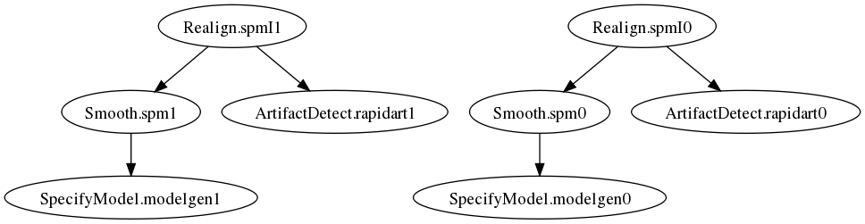

.. _tutorial_102:

============
Pipeline 102
============

Now that you know how to construct a pipeline and execute it, we will
go into more advanced concepts.

NodeWrapper options
===================

The following options allow you to manipulate various aspects of the
pipeline, such as, where the node is executed and outputs stored, how
to repeat some part or the entire pipeline over some parameters and
how to run an interface over multiple inputs when it only accepts one.

name
----

By default, the pipeline nodes are named based on the interface
used. These names are then used to create directory names for storing
node/interface output. So an :class:`nipype.interfaces.spm.Realign`
interface will be stored in a directory called *Realign.spm*. However,
an user can set this name. 

.. testcode::

   realigner = nw.NodeWrapper(interface=spm.Realign(),
                              name='StructRealign.spm')

Now this output will be stored in a directory called
*StructRealign.spm*. Naming your nodes can be advantages from the
perspective that it provides a semantic descriptor aligned with your
thought process. Also, if we change the name of an interface, you do
not have to recompute the output unless the functionality of the node
has changed. 

diskbased
---------

This is enabled by default and results in nodes being executed in
their own directory and depending on the nature of the underlying
interface, it's outputs are generated inside this directory. The
pipeline engine computes a hash of the input state of any node and if
executed with diskbased=True option (default) it will store this hash
in the output directory for the node (derived from the node name, see
above). This hash is then checked each time the node is
executed. Unless the inputs to the node have changed, this hash will
remain unique for a unique set of inputs. Details of the hash
calculation can be found further below.

This can be turned off for memory-based interfaces, i.e. those
interfaces that do not write any files to disk **AND** compute their
outputs always (developer note: via aggregate_outputs).

iterables
---------

This is syntactic sugar for running parts or all of your pipeline in
a for loop. For example, consider an fmri preprocessing pipeline that
you would like to run for all your subjects. You can define a workflow
and then execute it for every single subject inside a for
loop. Consider the simplistic example below.

.. testcode::
   
   for s in subjects:
       startnode.inputs.subject_id = s
       workflow.run()

The pipeline engine provides a convenience function that simplifies
this.

.. testcode::
   
   startnode.iterables = ('subject_id', subjects)
   workflow.run()

This will achieve the same exact behavior as the for loop above. The
workflow graph is:

Now consider the situation in which you want the last node (typically
smoothing) of your preprocessing pipeline to smooth using two
different kernels (0 mm and 6 mm FWHM). Again the common approach
would be: 

.. testcode::
   
   for s in subjects:
       startnode.inputs.subject_id = s
       uptosmoothingworkflow.run()
       smoothnode.inputs.infile = lastnode.output.outfile
       for fwhm in [0, 6]:
           smoothnode.inputs.fwhm = fwhm
           remainingworkflow.run()

Instead of having multiple for loops at various stages, you can set up
another set of iterables for the smoothnode.

.. testcode::
   
   startnode.iterables = ('subject_id', subjects)
   smoothnode.iterables = ('fwhm', [0, 6])
   workflow.run()

This will run the preprocessing workflow for two different smoothing
kernels over all the subjects. 

.. image:: images/proc2subj2fwhm.png
   :width: 650 px

Thus setting iterables has a multiplicative effect. In the above
examples there is a separate, distinct specifymodel node that's
executed for each combination of subject and smoothing.

iterfield
---------

This is another convenience option to run your underlying interface
over a set of inputs when the interface can only operate on a single
input. For example, the :class:`nipype.interfaces.fsl.Bet` will
operate on only one (3d or 4d) nifti file. But a node wrapping Bet can
execute it over a list of files.

.. testcode::

   better = nw.NodeWrapper(interface=fsl.Bet())
   better.inputs.infile = ['file1.nii','file2.nii']
   better.iterfield = ['infile']
   better.run()

This will create a directory called Bet.fsl and inside that two
subdirectories called infile_0 and infile_1. The output of running bet
separately on each of those files will be stored in those two
directories. 

This can be extended to run it on pairwise inputs. For example,

.. testcode::

   transform = nw.NodeWrapper(interface=fs.ApplyVolTransform())
   transform.inputs.sourcefile = ['file1.nii','file2.nii']
   transform.inputs.fslreg = ['file1.reg','file2.reg']
   transform.iterfield = ['sourcefile','fslreg']
   transform.run()

The above will match perform runs by taking corresponding items from
each of the two fields in iterfield. The subdirectories are always
named with respect to the first iterfield.
 

Distributed computation
=======================

The pipeline engine has built-in support for distributed computation
on clusters via the Ipython_ distributed computing interface. As long
as the user sets up a workflow on a shared filesystem and has
configured the environment for distributed computation using ipython_,
the pipeline engine's run() function will automatically take advantage
of the cluster. In some cases it may be advantageous to run the
workflow in series locally (e.g., debugging, small-short pipelines,
large memory only interfaces, relocating working directory/updating
hashes). 

.. testcode::

   workflow.run_in_series()

Some details of setting up your cluster can be found in
:ref:`parallel_processing`. 

Relocation of workdir
=====================

In some circumstances, one may have moved their entire working
directory to a new location. It would be convenient to rerun only
necessary components of the pipeline, instead of running all the nodes
all over again. One can do that with the updatehash() function.

.. testcode::

   workflow.updatehash()

This will execute the workflow and update all the hash values that
were stored without actually running any of the interfaces.

Caveats
-------

Any interface that stores a filename within a generated file will trip
(e.g., spm/fsl.Level1Design, SpecifyModel.modelgen). This is because
the outputs are not regenerated in this hash update. If your workflow
contains such interfaces and none of your parameters or underlying
packages have changed, then you can relocate and rexecute.

.. testcode::

   workflow.updatehash(force_execute=['spm.level1design',
                                      'specifymodel.modelgen'])

The names for force_execute has to correspond to the directories that
were created.

Debugging
=========

When a crash happens while running a pipeline, a crashdump is stored
in the pipeline's working directory unless
pipeline.config['crashdumpdir'] has been set. The crashdump is a dict
containing three fields:

  1. node - the node that failed
  2. execgraph - the graph that the node came from
  3. traceback - from local or remote session for the failure. 

we will keep improving the information contained in the file and make
it easier to debug yourself. However, in the meantime the following
can help recover information related to the failure.

in ipython do (%pdb in ipython == dbstop if error in matlab):

.. testcode::

   from nipype.utils.filemanip import loadflat
   crashinfo = loadflat('crashdump....npz')
   %pdb
   crashinfo['node'].run()  # re-creates the crash
   pdb> up  #typically, but not necessarily the crash is one stack frame up
   pdb> inspect variables
   pdb>quit

.. include:: ../links_names.txt
